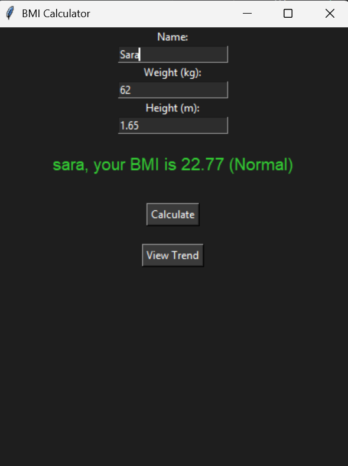
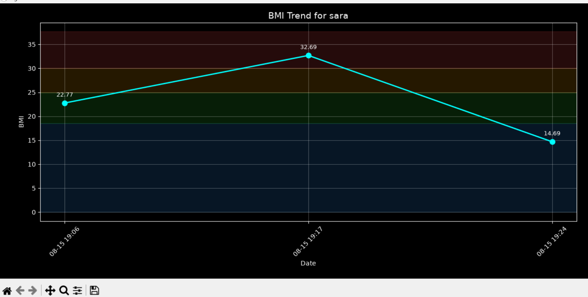

# BMI Calculator (Advanced) — Python Task 2

Part of the Oasis Infobyte Summer Internship Program (OIBSIP) — Python Programming track.

## Objective
A Python desktop application that calculates a user's Body Mass Index (BMI), classifies it into standard health categories, and tracks BMI history over time with a visual trend graph.

## Tech Stack
- **Python 3**
- **tkinter** — GUI
- **sqlite3** — local database for storing records
- **matplotlib** — BMI trend visualization

## Features
- GUI built with tkinter — no command line required
- Input fields for Name, Weight (kg), and Height (m) with a Calculate button
- BMI calculated using the standard formula: `BMI = weight / (height²)`
- Results classified into Underweight / Normal / Overweight / Obese, shown with color-coded feedback
- Input validation — rejects non-numeric and negative values with clear error messages
- Multi-user support — records are saved per name (case-insensitive, so "Zainab" and "zainab" are treated as the same person)
- Historical records stored permanently in a local SQLite database (`bmi_records.db`)
- "View Trend" button generates a matplotlib line chart of a user's BMI over time, with color-coded background zones matching each BMI category
- Error handling around all database read/write operations

## Project Structure
```
Python-Task2-BMICalculator/
├── bmi_logic.py       # BMI calculation + classification logic (no UI code)
├── bmi_gui.py          # tkinter GUI, event handling, entry point
├── bmi_database.py     # SQLite setup, save/read functions
└── bmi_records.db       # auto-generated database file (created on first run)
```

## How to Run
1. Make sure Python 3 is installed
2. Install the one external dependency:
   ```
   pip install matplotlib
   ```
3. Run the app:
   ```
   python bmi_gui.py
   ```

## Screenshots

### Main Calculator


### BMI Trend Graph


## Author
Zainab Parveen — OIBSIP Python Programming Internship
