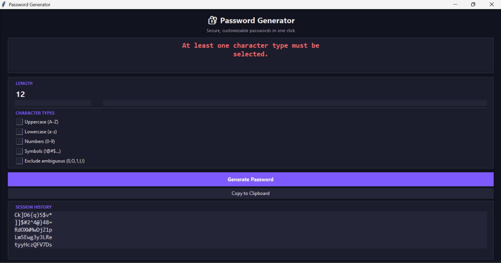

# Password Generator (Advanced) — Python Task 3

Part of the Oasis Infobyte Summer Internship Program (OIBSIP) — Python Programming track.

## Objective
A Python desktop application that generates strong, cryptographically secure random passwords based on user-defined criteria, with a real-time strength indicator and session-based history.

## Tech Stack
- **Python 3**
- **tkinter** — GUI
- **secrets** — cryptographically secure random generation (not the standard `random` module)
- **pyperclip** — clipboard integration

## Features
- GUI built with tkinter, styled with a dark theme and card-based layout
- Slider to control password length (8–32 characters)
- Checkboxes to include/exclude: uppercase, lowercase, numbers, symbols
- Option to exclude ambiguous characters (0, O, 1, l, I)
- Uses Python's `secrets` module — designed specifically for security-sensitive randomness, unlike the standard `random` module
- Security rule enforced: the generated password is guaranteed to contain at least one character from every selected type
- Real-time password strength indicator (Weak / Medium / Strong), color-coded, based on length and character variety
- "Copy to Clipboard" button (password is also copied automatically on generation)
- Session history — displays the last 5 generated passwords, kept in memory only and never written to disk or a database, for security
- Input validation — enforces a minimum length of 8 and a minimum of 2 selected character types, with clear error messages

## Project Structure
```
Python-Task3-PasswordGenerator/
├── password_logic.py    # password generation + strength logic (no UI code)
├── password_gui.py       # tkinter GUI, event handling, entry point
└── Screenshots/
```

## How to Run
1. Make sure Python 3 is installed
2. Install the one external dependency:
   ```
   pip install pyperclip
   ```
3. Run the app:
   ```
   python password_gui.py
   ```

## Screenshots


## Author
Zainab Parveen — OIBSIP Python Programming Internship
